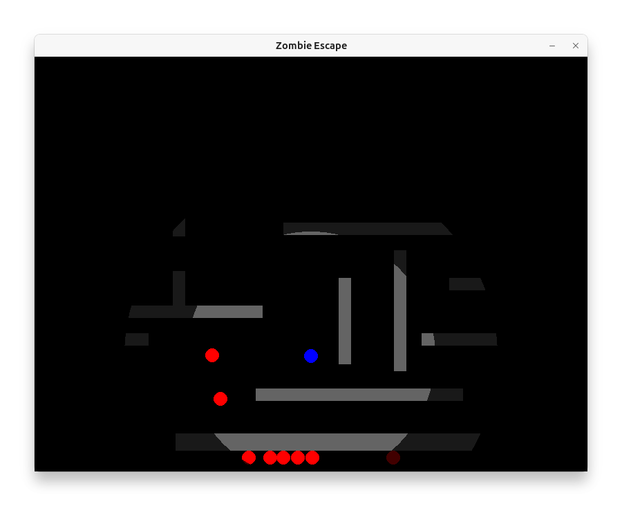

# ゾンビエスケープ

街はゾンビで埋め尽くされた！
君は追っ手を振り切り、工場の廃墟へと逃げ込んだ。

入り組んだ迷路のような内部。これならヤツらもすぐには入れまい。
だが、武器はない。外は夜。停電で工場内も真っ暗だ。

頼りは一本の懐中電灯のみ。
どこかにあるはずの車……それが唯一の希望。

闇を照らし、車を探し出せ！
そして、この悪夢の街から脱出するのだ！

## 概要

このゲームは、ゾンビが徘徊する広大な建物の中から、車を見つけて脱出することを目指す、シンプルな2Dトップダウンビューのアクションゲームです。プレイヤーはゾンビから逃げ回り、壁を破壊しながら活路を見つけ出し、車に乗って建物の外へ脱出します。




## 操作方法

-   **プレイヤー/車の移動:** `W` / `↑` (上), `A` / `←` (左), `S` / `↓` (下), `D` / `→` (右)
-   **車への乗車:** プレイヤーを車に重ねる
-   **ゲーム終了:** `ESC` キー
-   **リスタート:** (ゲームオーバー/クリア画面で) `R` キー
-   **ウィンドウ拡大縮小（タイトル/設定画面のみ）:** `[` で縮小、 `]` で拡大

## 設定（タイトル画面）

タイトル画面の **Settings** から次の項目をON/OFFできます：

-   **足跡:** 暗闇でも戻り道を思い出せるよう、足跡を残します。
-   **Fast zombies:** 高速ゾンビを出現させます（各ゾンビが通常〜高速の間で個別に速度を振り分け）。
-   **Car hint:** 一定時間後に、燃料（Stage 2未取得時）や車の方向を示す三角マーカーを表示します。
-   **Flashlight pickups:** 拾うと視界が広がる懐中電灯をステージに出現させます。

## ルール

### ステージ選択

タイトル画面で以下のステージを選択できます：

- **Stage 1: Find the Car** — 車を見つけて脱出する。
- **Stage 2: Fuel Run** — まず燃料缶を見つけて拾い、その後車を見つけて脱出する。

プレイ中、画面左上に現在の目的が表示されます。

### キャラクター/アイテム

-   **プレイヤー:** 青い丸。WASDキーまたは矢印キーで操作します。
-   **足跡:** プレイヤーが歩くと一定距離ごとに足跡が残り、しばらくの間消えずに薄く残り続けます。迷いやすい広いマップで「さっき通った場所」を思い出す手がかりになります。
-   **ゾンビ:** 赤い丸。プレイヤー（または車）を発見すると追跡してきます。
    -   視界範囲外では、一定時間ごとに移動モードがランダムに切り替わります（水平/垂直のみ移動、側面移動、ランダム移動など）。
-   **車:** 黄色い四角。プレイヤーが接触すると乗ることができます。
    -   車には耐久力があり、内部の壁に衝突したり、ゾンビを轢いたりすると減少します。
    -   耐久力が0になると車は破壊され、その場にプレイヤーが降ろされます。
    -   車が破壊されると、ステージ内のランダムな位置に**新しい車が再出現**します。
    -   ゲーム開始から約5分経過すると、プレイヤーの周囲に目的地の方向を示す小さな三角形が表示されます（Stage 2 では燃料缶未取得なら燃料缶を、取得後は車を指します。Stage 1 では車を指します。）。視界に入ると非表示になります。
-   **燃料缶 (Stage 2のみ):** 黄色いポリタンク。拾ってからでないと車に乗れません。
-   **懐中電灯:** デフォルトで有効（設定で無効化可能）。有効時は全ステージに出現し、拾うと視界の半径が35%広がります。
-   **壁:** 外周壁はグレー、内部壁はベージュ。
    -   **外周壁:** ステージを囲む破壊不能に近い壁。各辺に最低3つの開口部（出口）があります。
    -   **内部壁:** 建物の内部にランダムに配置されるベージュの壁。内部壁のセグメントは耐久力を持ち、 **プレイヤーは壁を破壊できます。** 繰り返し接触して耐久力を減少させて0にしてください。車は破壊できません。

### 勝利・敗北条件

-   **勝利条件:** 車に乗った状態で、ステージ（レベル）の境界線の外に出る。
    - Stage 2 では、燃料缶を取得していることが必須です。
-   **敗北条件:**
    -   プレイヤーが車に乗っていない状態でゾンビに接触する。
    -   (注: 現在の実装では、車が破壊されても即ゲームオーバーにはなりません。新しい車を探して脱出を目指します。)

### 視界・暗転（フォグ）

- プレイヤー周囲のみ明るく、それ以外は段階的に暗くなるフォグを採用しています。
- フォグは複数のリング状レイヤで構成され、離れるほど濃いディザ（ベイヤー型ドット）が重なって視界が塞がります。中心から離れると急速に黒に埋もれるため、探索は足跡や地形を頼りに進めてください。

## 実行方法

**（必要環境: Python 3.10 以上）**

pipxでインストールしてください。

```sh
pipx install git+https://github.com/tos-kamiya/zombie-escape
```

あるいは、gitとpipを利用して次のようにインストールすることもできます。

```sh
git clone https://github.com/tos-kamiya/zombie-escape
cd zombie-escape
pip install .
```

次のコマンドラインにより起動します。

```sh
zombie-escape
```

**Windows向けのexeファイル** もあります。[リリースページ](https://github.com/tos-kamiya/zombie-escape/releases)からダウンロード可能です。

## ライセンス

このプロジェクトは MIT License の下で公開されています。詳細は[LICENSEファイル](LICENSE.txt)をご覧ください。

## 謝辞

このゲームの開発において、Python/Pygameによるコード生成、ルール調整の提案、デバッグ支援、そしてこのREADMEの作成に至るまで、技術的な実装とドキュメンテーションの多くの部分で Google の大規模言語モデル Gemini (開発時アクセスモデル) と OpenAI の GPT-5 から多大な協力を得ました。その迅速なコーディング能力と問題解決への貢献に深く感謝いたします。
