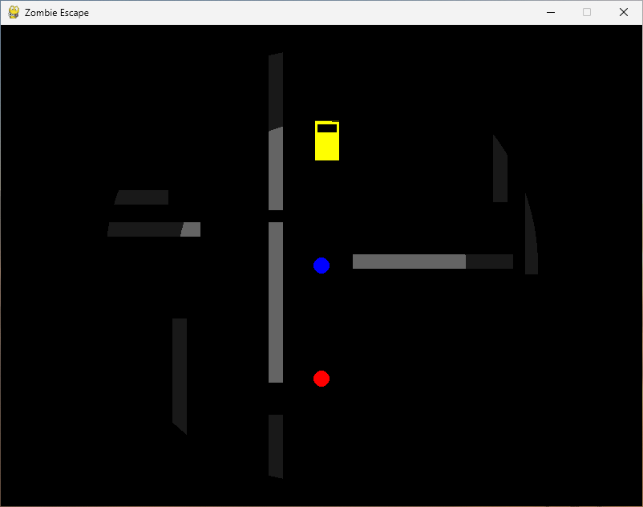

# ゾンビエスケープ

## 概要

このゲームは、ゾンビが徘徊する広大な建物の中から、車を見つけて脱出することを目指す、シンプルな2Dトップダウンビューのアクションゲームです。プレイヤーはゾンビから逃げ回り、壁を破壊しながら活路を見つけ出し、車に乗って建物の外へ脱出します。

## スクリーンショット




## 操作方法

-   **プレイヤー/車の移動:** `W` / `↑` (上), `A` / `←` (左), `S` / `↓` (下), `D` / `→` (右)
-   **車への乗車:** プレイヤーを車に重ねる
-   **ゲーム終了:** `ESC` キー
-   **リスタート:** (ゲームオーバー/クリア画面で) `R` キー

## ゲームルール

### 登場要素

-   **プレイヤー:** 青い丸。WASDキーまたは矢印キーで操作します。
-   **ゾンビ:** 赤い丸。プレイヤー（または車）を発見すると追跡してきます。
    -   ゾンビはプレイヤーが視界範囲 (`ZOMBIE_SIGHT_RANGE`) に入ると、プレイヤーを直接追跡するモードになります。
    -   視界範囲外では、一定時間ごとに移動モードがランダムに切り替わります（水平/垂直のみ移動、側面移動、ランダム移動など）。
-   **車:** 黄色い四角。プレイヤーが接触すると乗ることができます。
    -   車には耐久力があり、内部の壁に衝突したり、ゾンビを轢いたりすると減少します。
    -   耐久力が0になると車は破壊され、その場にプレイヤーが降ろされます。
    -   車が破壊されると、ステージ内のランダムな位置に**新しい車が再出現**します。
-   **壁:** 灰色の四角。
    -   **外周壁:** ステージを囲む破壊不能に近い壁。各辺に最低3つの開口部（出口）があります。
    -   **内部壁:** 建物の内部にランダムに配置される壁。短いセグメントで構成されています。

### 勝利・敗北条件

-   **勝利条件:** 車に乗った状態で、ステージ（レベル）の境界線の外に出る。
-   **敗北条件:**
    -   プレイヤーが車に乗っていない状態でゾンビに接触する。
    -   (注: 現在の実装では、車が破壊されても即ゲームオーバーにはなりません。新しい車を探して脱出を目指します。)

### 特殊ルール

-   **視界制限:** プレイヤー（または乗っている車）の周囲の一定範囲のみが見えます。
    -   中心部ははっきりと見えます (`FOV_RADIUS`)。
    -   その周囲の少し広い範囲 (`FOV_RADIUS * FOV_RADIUS_SOFT_FACTOR`) は、ぼんやりと見えます。
    -   それより外側は完全に見えません。
-   **壁破壊:** プレイヤーが内部壁のセグメントに繰り返し接触すると、そのセグメントの耐久力が減少し、0になると破壊され消滅します。車は壁を破壊できません。
-   **スクロール:** ステージは画面よりも広大で、プレイヤー（または車）の移動に合わせて画面がスクロールします。マップの端に近づくとスクロールは停止します。

## 実行方法

pipxでインストールしてください。

```sh
pipx install git+https://github.com/tos-kamiya/zombie-escape
```

あるいは、gitとpipを利用して次のようにインストールすることもできます。

```sh
git clone https://github.com/tos-kamiya/zombie-escape
cd zombie-escape
pip install .
```

次のコマンドラインにより起動します。

```sh
zombie-escape
```

## 謝辞

このゲームの開発において、Python/Pygameによるコード生成、ルール調整の提案、デバッグ支援、そしてこのREADMEの作成に至るまで、技術的な実装とドキュメンテーションの多くの部分で Google の大規模言語モデル Gemini (開発時アクセスモデル) から多大な協力を得ました。その迅速なコーディング能力と問題解決への貢献に深く感謝いたします。
