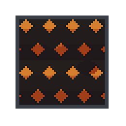

# Stages 26-35 Additions

This page covers additions first appearing in Stages 26-35.

| Name | Image | First Appears | Notes |
| --- | --- | --- | --- |
| Empty Fuel Can |  | Stage 26 | Pickup item used in stages where the empty fuel can appears. |
| Fuel Station |  | Stage 26 | Refills the empty fuel can in stages where the empty fuel can appears. |
| Zombie (Lineformer) |  | Stage 27 | A zombie that likes to form lines. |
| Puddle |  | Stage 28 | Slows movement while you are on the puddle tile. |
| Spiky Plant |  | Stage 28 | Humanoids move more slowly on it. Zombies get trapped and can no longer move. |
| Zombie Dog (Nimble) |  | Stage 31 | Skittering zombie dog. |
| Fire Floor |  | Stage 32 | Floor with visible flames below. Zombies burn out. Humanoids can jump over short corner distances. |

## Fuel Rule Change (Stages with Empty Fuel Can)

In stages where the empty fuel can appears, fuel handling is different:

- Regular fuel-can stages: `Player -> fuel can -> car`
- Stages where the empty fuel can appears: `Player -> empty fuel can -> fuel station -> car`

You cannot skip the station in stages where the empty fuel can appears.
