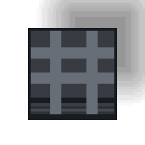

# ステージ36〜ノート

このページは、ステージ36以降のノートをまとめたものです。

## ステージ

- **ステージ36: 資材倉庫**
- **ステージ37: ロボットたち**
- **ステージ38: 追跡するものたち**
- **ステージ39: 立入禁止区画**
- **ステージ40: 生存確率**

## キャラクター、アイテム、地形ノート

| 名前 | 画像 | 初登場 | メモ |
| --- | --- | --- | --- |
| 運搬ロボット |  | ステージ36 | 直線上を移動しながら資材を運搬・設置するロボット。 |
| 資材 |  | ステージ36 | 運搬ロボットが扱う運搬物。衝突時の障害物としても機能する。 |
| 追跡ゾンビ犬 |  | ステージ38 | 足跡を追跡してしつこく接近するゾンビ犬の亜種。 |

## ステージ40のルールメモ（相棒 + 持久戦）

ステージ40は、相棒要件と持久戦目的を組み合わせた最初のステージです。

- 勝利条件:
  - 使用可能な車はないため、まず夜明けまで生存する。
  - 夜明け後に、同僚と合流している状態で、建物外周の開口部から徒歩で脱出する。
    （内部判定: `buddy_onboard + nearby_following_buddies >= buddy_required_count`）
- 敗北条件:
  - 他ステージ同様、プレイヤーがゾンビに接触するとゲームオーバー。
  - 相棒ステージの敗北条件も適用され、相棒が（視認可能な状態で）捕まるとゲームオーバー。

## ステージ40の解法ヒント（ネタバレあり）

**[SPOILER]** 以下は解法のヒントです。自力で試したい場合はここから先を読まないでください。

### ステージのレイアウト

- ステージ中央は、炎床（行）と水たまり（列）で区切られた `4x4` のグリッド構造になっています。
- 各グリッドセルの中央には落下スポーン領域があり、同僚を引き連れて移動するとゾンビに接触されやすくなります。
- 上下外周にある「凹」型の領域は、巡回ロボットの進行方向を揃えて往復させるための導入レーンとして機能します。

### この配置から生じる制約

- プレイヤー:
  - `4x4` グリッドの外にいるのが安全です。
  - グリッドの内側に行くには、グリッドの行方向（左右方向）の通行が必要になります。
- 巡回ロボット:
  - プレイヤーが方向を変えて、「凹」の形で折り返すようにすると、グリッドの列方向（上下方向）を往復するようにできます。

### 戦略

- 巡回ロボットを往復させ、グリッドの内側にいて落下スポーン床からゾンビが出たときに、周回してきた巡回ロボットを現場で足止めし、感電攻撃で処理します。

### 想定解

1. まず巡回ロボットを各列で上下往復する状態に整える。
2. その安全化した状態を維持しながら、夜明けまで生存する。
3. 夜明け後に、同僚に一人ずつ合流して回る。
4. 合流状態を維持したまま、外周の開口部から徒歩で脱出する。
