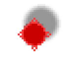

# ステージ6以降の追加要素

ステージ6以降は、ステージ1〜5をすべてクリアすると解放されます。タイトル画面で左右キーを使って選択できます。

## 操作デバイスの推奨（ステージ21以降）

ステージ21以降（ゾンビ犬が登場する以降）は、ジョイパッドまたはマウス操作を推奨します。ゾンビ犬は視界外から素早く突入してくるため、キーボードのみだと移動キーを強く押しすぎることがあります。

## ステージ6以降で初登場するもの

| 名前 | 画像 | 初登場 | メモ |
| --- | --- | --- | --- |
| 追跡ゾンビ |  | ステージ6 | 足跡を追いかける個体。 |
| 壁沿いゾンビ |  | ステージ7 | 壁沿いをウロウロする個体。 |
| 靴 |  | ステージ11 | 移動速度が上がるアイテム。 |
| 落下スポーン床 |  | ステージ12 | 通常の床とは違って錆びた鉄のような色。ゾンビが上から落ちてくる場所。 |
| 崩落壁 |  | ステージ14 | 内部壁の崩落した見た目になったバリエーション。 |
| 落とし穴 |  | ステージ16 | ゾンビは落下する。人間はコーナーの短い距離なら飛び越えられるが、飛び越え損なうと落下する。 |
| 強化壁 |  | ステージ18 | 外周壁と同じ硬さの壊せない内部壁。 |
| ゾンビ犬 |  | ステージ21 | 突進する個体。近くのゾンビを追う性質もある。 |
| 巡回ロボット |  | ステージ22 | 不審者を見分ける機能がある頼もしいロボット。ゾンビには麻痺とダメージを与える。停止中のロボットに重なった状態で、いったん方向入力を離し、その後に方向入力すると向きを指示できる。 |
| 動く床 |  | ステージ24 | 乗ると高速に移動できる床。 |
| 空の燃料缶 |  | ステージ26 | 空の燃料缶が出現するステージで使う取得アイテム。 |
| 給油所 |  | ステージ26 | 空の燃料缶が出現するステージで空缶を満タンにする地点。 |
| 行列ゾンビ |  | ステージ27 | 列を作りたがるゾンビ。 |
| 単独ゾンビ |  | ステージ34 | 群れを避けて単独で動こうとする個体。 |
| 水たまり |  | ステージ28 | 水たまりセル上にいる間、移動速度が低下する。 |
| トゲトゲの観葉植物 |  | ステージ28 | 通常状態だと人間は移動速度が遅くなる。ゾンビは引っかかる。ゾンビが3体以上引っかかると枯れてしまい、そのセルの床がゾンビ感染源になる。 |
| ちょこまかゾンビ犬 |  | ステージ31 | ちょこまか動くゾンビ犬。 |

## 燃料ルールの違い（空の燃料缶が出るステージ）

空の燃料缶が登場するステージでは、燃料の流れが通常ステージと異なります。

- 通常の燃料缶ステージ: `プレイヤー -> 燃料缶 -> 車`
- 空の燃料缶が出現するステージ: `プレイヤー -> 空の燃料缶 -> 給油所 -> 車`

空の燃料缶が出現するステージでは、給油所を経由せずに脱出準備を完了することはできません。
