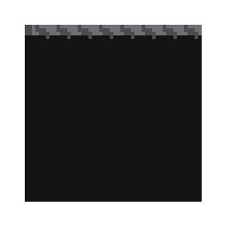
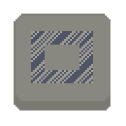
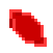
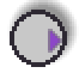
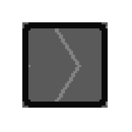
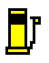
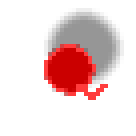
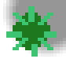

# Stage 6+ Additions

Stages 6+ unlock after clearing Stages 1–5. On the title screen, use left/right to select later stages.

## Control Recommendation (Stage 21+)

From Stage 21 onward (when zombie dogs appear), a gamepad or mouse is recommended. Zombie dogs can rush in quickly from outside your view, so keyboard-only control can lead to over-pressing movement keys.

## New Additions in Stage 6+

| Name | Image | First Appears | Notes |
| --- | --- | --- | --- |
| Zombie (Tracker) |  | Stage 6 | Follows footprints. |
| Zombie (Wall-Hugging) |  | Stage 7 | Stays along walls. |
| Shoes |  | Stage 11 | Increases movement speed. |
| Falling Spawn Floor |  | Stage 12 | Rusted-iron-looking floor; zombies drop from above here. |
| Wall Rubble |  | Stage 14 | Variant of inner wall with a collapsed look. |
| Pitfall |  | Stage 16 | Zombies fall in. Humans can hop short corner gaps, but a missed jump also means falling in. |
| Reinforced Wall |  | Stage 18 | An unbreakable inner wall with the same toughness as the outer wall. |
| Zombie Dog |  | Stage 21 | Fast charging zombie that also chases nearby zombies. |
| Patrol Bot |  | Stage 22 | A dependable robot that can spot suspicious individuals; it paralyzes and damages zombies. While overlapping a stopped bot, release direction input once, then input a direction to command it. |
| Moving Floor |  | Stage 24 | A floor you can ride to move quickly in its direction. |
| Empty Fuel Can |  | Stage 26 | Pickup item used in stages where the empty fuel can appears. |
| Fuel Station |  | Stage 26 | Refills the empty fuel can in stages where the empty fuel can appears. |
| Zombie (Lineformer) |  | Stage 27 | A zombie that likes to form lines. |
| Puddle |  | Stage 28 | Slows movement while you are on the puddle tile. |
| Spiky Houseplant |  | Stage 28 | In its normal state, humanoids move more slowly on it. Zombies get trapped in it. Once 3 or more zombies are trapped, the plant withers and the floor on that same tile becomes a zombie contamination source. |
| Zombie Dog (Nimble) |  | Stage 31 | Skittering zombie dog. |

## Fuel Rule Change (Stages with Empty Fuel Can)

In stages where the empty fuel can appears, fuel handling is different:

- Regular fuel-can stages: `Player -> fuel can -> car`
- Stages where the empty fuel can appears: `Player -> empty fuel can -> fuel station -> car`

You cannot skip the station in stages where the empty fuel can appears.
