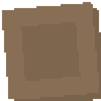

# Stages 6-15 Additions

This page covers additions first appearing in Stages 6-15.

For later pages:
- `docs/stages-16plus.md` (Stages 16-25)
- `docs/stages-26plus.md` (Stages 26-35)

| Name | Image | First Appears | Notes |
| --- | --- | --- | --- |
| Zombie (Tracker) |  | Stage 6 | Follows footprints. |
| Zombie (Wall-Hugging) |  | Stage 7 | Stays along walls. |
| Shoes |  | Stage 11 | Increases movement speed. |
| Falling Spawn Floor |  | Stage 12 | Rusted-iron-looking floor; zombies drop from above here. |
| Wall Rubble |  | Stage 14 | Variant of inner wall with a collapsed look. |
